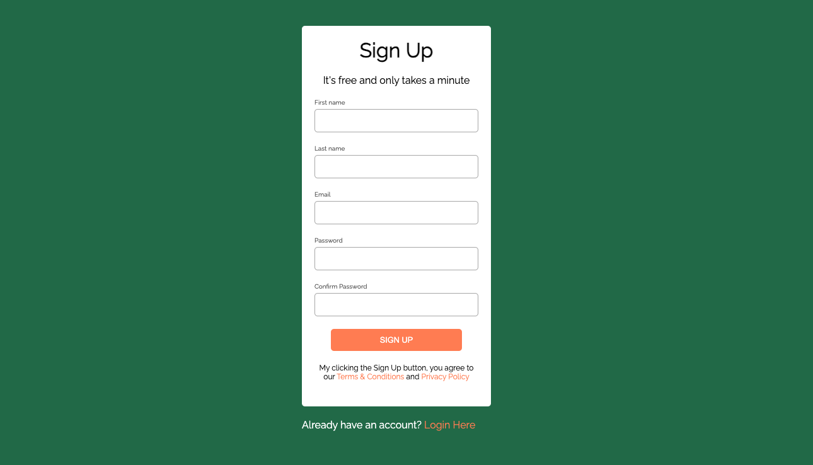

# Uutiskirjeen tilauslomake

# 1. Projektin alustus

- Luo viikko_04 kansio ja lisää seuraavat tiedostot:
  - `index.html`
  - `styles.css`

# 2. Lomake

- Toteuta lomake, joka on mahdollisimman lähellä tätä kuvaa: 
- Lisää ensin tarvittavat lomakekentät.

# 3. CSS asettelut

- Hio lomakkeen asettelu ja ulkonäkö kuntoon.
- Sivulla käytetty fontti on **Raleway**

# 4. Validaatio

- Varmista, että sivu validoi käyttäjän antamat tiedot.
